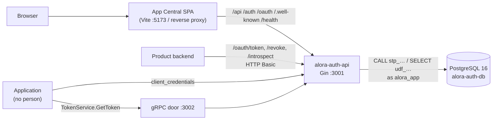

# Architecture map

A map for finding your way. For behaviour read [SPEC.md](../../SPEC.md); for the
full architecture read [ARCHITECTURE.md](../../alora-auth-api/ARCHITECTURE.md).[^arch]

## The four projects

| Project | Owns | Talks to |
|---|---|---|
| `alora-auth-db` | Tables, views, functions (`udf_`, reads) and procedures (`stp_`, writes) — all the SQL there is. Generated from `gen_*.py`. | — |
| `alora-auth-api` | App Central's API (`/api`, `/auth`), the OpenID Provider (`/oauth`, `/.well-known`), the gRPC `TokenService` | the database, as the least-privilege role `alora_app` |
| `alora-auth-ui` | The SPA on Vite (sign-in, launcher, admin, Owner console), `sample-product.cjs`, the Playwright suite | the API through Vite's proxy — one origin |
| `alora-auth-go` | Protos and their generated code, the token `Verifier`, gRPC interceptors, client credentials for applications | the API's token endpoint and JWKS; never imports App Central |

## Request path

The browser only ever sees App Central's origin. A product runs on its own host,
keeps its tokens on its backend, and verifies them against the JWKS.[^readme]

## The API's layers

Every row's imports are enforced by `TestArchitecture`.[^archtest]

| Package | Role | May import (internal) |
|---|---|---|
| `cmd/api` | Composition root. `main.go`: config → keys → DbContext → `newModules` → router (middleware order is semantic) → gRPC → jobs. `modules.go`: the one place services and controllers are wired. | anything |
| `internal/core/<feature>/controller` | The HTTP/gRPC edge: binding, swag annotations, `exceptions.Fail` | `exceptions`, `middlewares`, `core/shared`, its own `service` and `models` |
| `internal/core/<feature>/service` | Business rules and transactions | `exceptions`, `core/shared/**`, `infrastructure`, `database/{contexts,models,services/**}`, its own `models`, other features' `service`/`models` |
| `internal/core/<feature>/models` | DTOs, requests, responses | `core/shared` |
| `internal/core/shared` | Scope registry, cookies, return-to, binding; `crypto/{jwtkeys,password,pkce,secretbox,tokens}` | `exceptions` |
| `internal/middlewares` | The perimeter: authentication, scope and Owner guards, same-origin, CORS (`/.well-known` only), security headers, body limit, rate limits and their `Store`, pressure, recovery, error rendering | `exceptions`, `core/shared`, `core/shared/crypto/jwtkeys` |
| `internal/infrastructure` | The outside world and background work: mailer, OIDC/Google clients, sweeps, the shared rate-limit store | `config`, `database/contexts`, `database/services/**` |
| `internal/database/contexts` | The pool; `Begin` → transaction | `database/sqlc` |
| `internal/database/services/<table>` | One package per table: `<table>DbService.go`, and `customs/` for views, lookups and sweeps | `database/{contexts,models,sqlc,services}` |
| `internal/database/models` | Plain Go row types and the DB enums (a nullable column is a pointer) | none |
| `internal/database/sqlc` | Generated bindings; imported only inside `internal/database` | none |
| `internal/exceptions` | Sentinel errors, `APIError`, `MapError` (error → status) | none |
| `internal/config` | Fail-fast environment loading | none |

Features: `apiclient`, `audit`, `auth`, `group`, `health`, `invitation`, `login`,
`oauth`, `owner`, `policy`, `reset`, `session`, `sso`, `tenant`, `user`. gin and
gRPC appear only in controllers, middlewares and `cmd/api`.

## Data path

A feature service calls a table service, which calls a sqlc binding generated
from a named query in `alora-auth-db/api/*.sql`, which is a `CALL stp_…` or a
`SELECT … FROM udf_…`. No statement anywhere touches a table directly. Tenant
scoping lives in the procedures (`WHERE client_id = p_clientId`). The API connects
as `alora_app`, which can append to the audit trail but never change it, and
cannot create Owners. How to change any of it: the
[database-change playbook](./playbooks/database-change.md).

## The identity model in brief

- **App Central session**: an HttpOnly, host-only cookie holding the refresh token
  (`alora_cs` in development, `__Host-` prefixed in production), plus an access
  token in page memory for App Central alone. Each refresh rotates the token; a
  rotated-away token replayed after a 30-second grace window burns the whole login.
- **Product login**: `/oauth/authorize` (PKCE S256, exact redirect URI) → a code
  (single use, two minutes) → an access token with audience `product:<key>` and
  that product's roles (15 minutes), a rotating refresh token (12 hours at most,
  never past the App Central session) and, for `openid`, an ID token.
- **Applications**: API clients (`aci_…` / `acc_…`) use `client_credentials` with
  `resource=product:<key>`, over HTTP or gRPC: `principal` is `client`, with a
  `scope` and no refresh token.
- **Access**: App Central scopes, read and edit per feature, come from groups plus
  per-person extras; the Admins group holds all of them. Nobody gives a scope they
  lack (rule 1) or manages someone with more reach (rule 2). The Owner is bound by
  neither and alone decides product access. The company always comes from the
  token, never a request body.
- **Sessions in the database**: `tbl_session_families` is a login,
  `tbl_user_sessions` its refresh generations, and `vw_SessionFamilyGate` the single
  check run on every request and refresh. Details: [SPEC.md §2](../../SPEC.md).[^spec]

[^arch]: API architecture — package map, request lifecycle, security architecture
[^readme]: README — projects, quick start, how the pieces fit
[^archtest]: The layering guard
[^spec]: Behavioural specification — endpoints and security invariants
